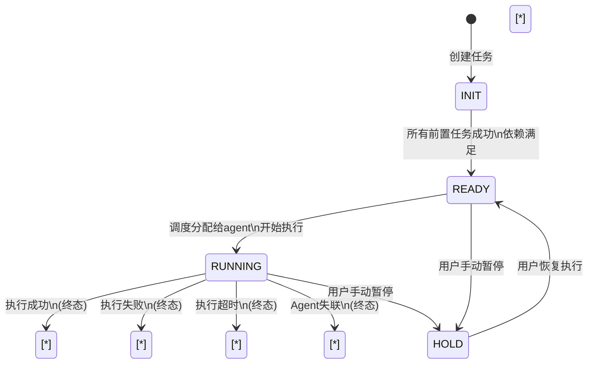

# DAG Task Status 状态转换设计

## 概述

本文档描述了 DAG 任务调度系统中任务的状态定义和合法状态转换规则。

## 状态定义

所有状态定义在 `top.ilovemyhome.dagtask.si.enums.TaskStatus` 枚举中：

| 状态 | 类型 | 描述 |
|------|------|------|
| `INIT` | 初始 | 任务已创建，但依赖尚未满足，等待前置任务完成 |
| `READY` | 等待调度 | 所有依赖已经满足，任务就绪，等待调度器分配给 agent 执行 |
| `HOLD` | 暂停 | 任务被用户手动暂停，不会被调度，可恢复 |
| `RUNNING` | 执行中 | 任务已分配给 agent，正在执行 |
| `UNKNOWN` | 终态 | 执行任务的 agent 失联（心跳超时），任务失败 |
| `SUCCESS` | 终态 | 任务执行成功 |
| `ERROR` | 终态 | 任务执行出错失败 |
| `TIMEOUT` | 终态 | 任务执行超时，被系统终止 |
| `SKIPPED` | 终态 | 任务被跳过，因为至少一个前置任务失败 |

## 便利方法

`TaskStatus` 枚举提供了便捷判断方法：

```java
// 是否为终态（不会再发生状态转换）
public boolean isTerminal() { ... }

// 是否正在执行
public boolean isRunning() { ... }

// 是否执行成功
public boolean isSuccessful() { ... }

// 是否为活跃状态（非终态，可以继续转换）
public boolean isActive() { ... }
```

## 状态转换图



## 状态转换表

| 当前状态 \ 事件 | 依赖满足 | 调度开始 | 执行成功 | 执行失败 | 执行超时 | 用户暂停 | 用户恢复 | Agent失联 |
|------------------|----------|------------|------------|------------|------------|----------|----------|------------|
| **INIT**        | READY    | -          | -          | -          | -        | -        | -        | -          |
| **READY**       | -        | RUNNING    | -          | -          | -        | HOLD     | -        | -          |
| **HOLD**        | -        | -          | -          | -          | -        | -        | READY     | -          |
| **RUNNING**     | -        | -          | SUCCESS    | ERROR      | TIMEOUT  | HOLD     | -        | UNKNOWN    |
| **(终态)**      | -        | -          | -          | -          | -        | -        | -        | -          |

## 关键设计原则

### 1. 终态不可退出
- 一旦任务进入终态 (`SUCCESS`, `ERROR`, `TIMEOUT`, `UNKNOWN`, `SKIPPED`)，不会再发生状态转换
- 这样设计简化了调度逻辑，避免重复处理已完成任务

### 2. SKIPPED 语义
- 当一个任务的**任意一个**前置任务失败/超时/未知，该任务直接标记为 `SKIPPED`
- 这是一个快速失败策略，避免无意义的执行
- `SKIPPED` 也是终态

### 3. HOLD 手动暂停
- 用户可以暂停 `READY` 或 `RUNNING` 状态的任务
- 暂停后的任务保持当前依赖状态，等待用户恢复
- 暂停不改变任务依赖，恢复后继续原有流程

### 4. UNKNOWN 失联处理
- 当执行任务的 agent 停止发送心跳超过配置阈值，系统标记任务为 `UNKNOWN` 终态
- 表示任务状态未知，系统无法确认任务实际执行结果，按失败处理

### 5. 调度器轮询处理
调度器周期性扫描：

1. **INIT** → 检查依赖是否全部完成，如果是 → 转 `READY`
2. **READY** → 如果有可用 agent 容量 → 分配执行 → 转 `RUNNING`
3. **RUNNING** → 检查超时 → 如果超时 → 转 `TIMEOUT`
4. **所有非终态** → 检查对应规则

## 数据库持久化

任务状态作为枚举值存储在 `t_task.status`  VARCHAR(50) 字段中。

## 示例流程

**成功路径：**
```
INIT → READY → RUNNING → SUCCESS
```

**前置失败路径：**
```
INIT ← 前置失败 → SKIPPED
```

**超时路径：**
```
INIT → READY → RUNNING → TIMEOUT
```

**暂停恢复路径：**
```
INIT → READY → HOLD → READY → RUNNING → SUCCESS
```
