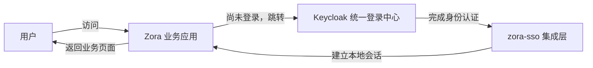
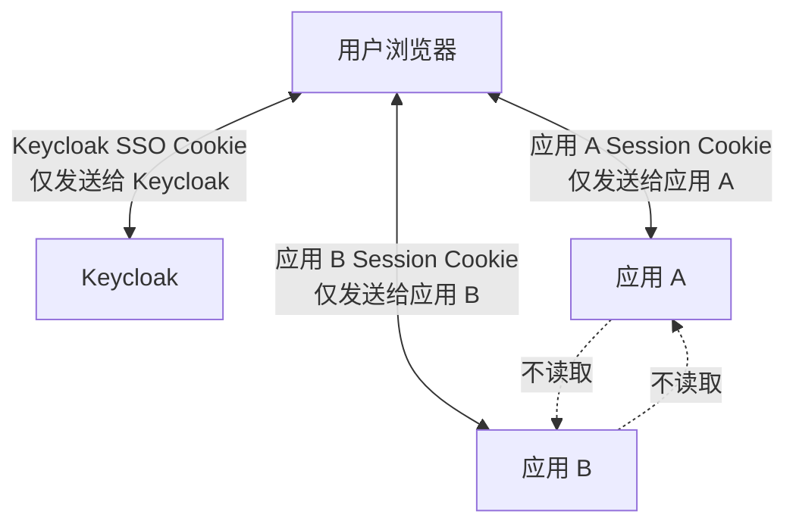
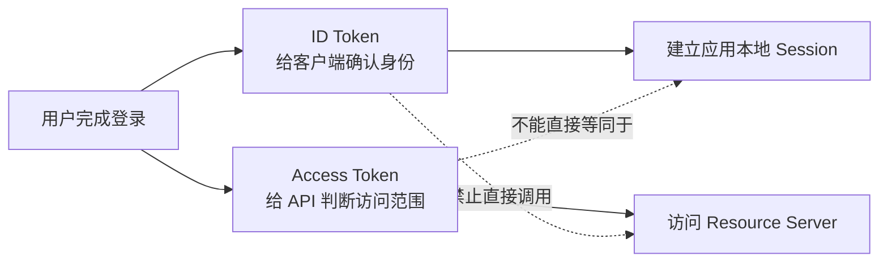
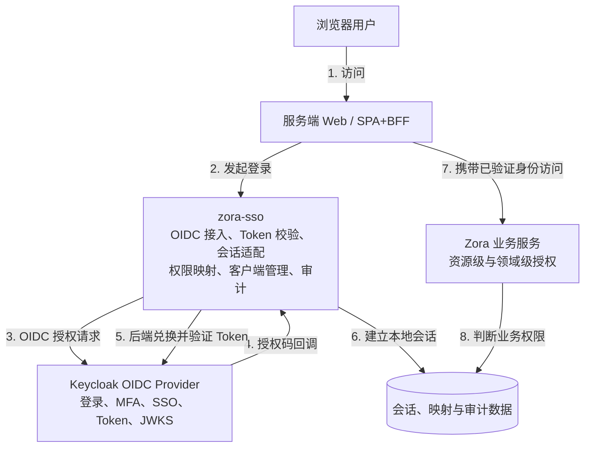
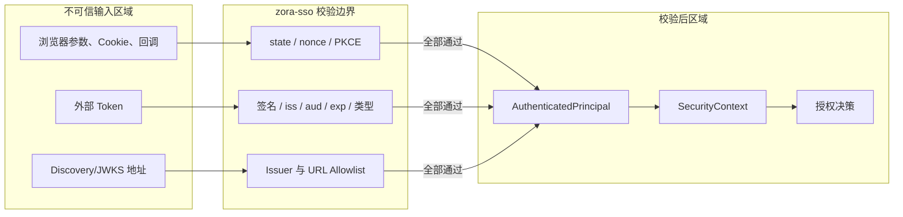
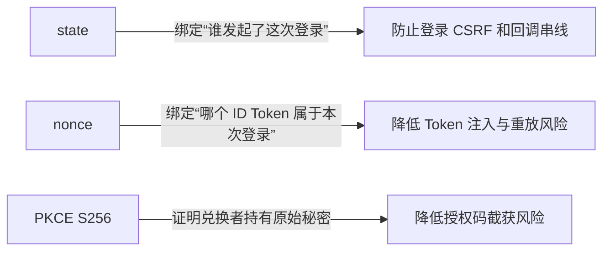
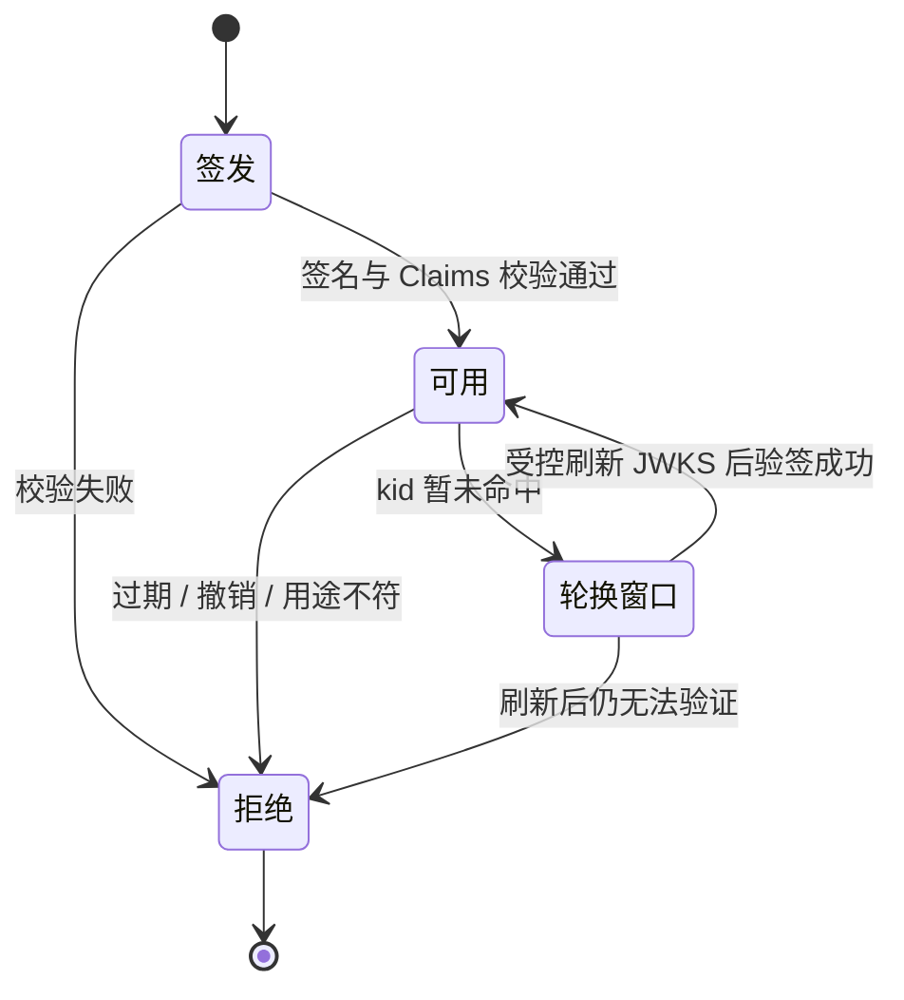
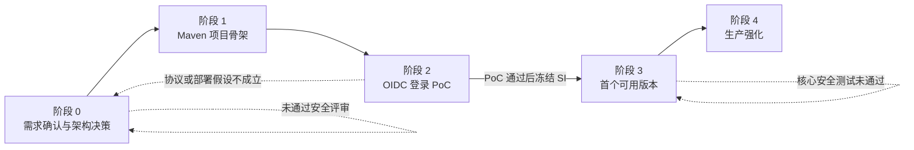

# zora-sso 项目实施计划

## 0. 初学者阅读指南

如果此前没有接触过 OAuth 2.0、OpenID Connect（OIDC）或单点登录，可以先只阅读本节，再阅读第 5、8、9、12 节。协议名暂时不需要全部记住，先理解“谁负责什么”和“浏览器在谁之间跳转”。

### 0.1 一句话理解这个项目

`zora-sso` 不负责检查用户名和密码，而是把用户带到可信的 Keycloak 登录中心；Keycloak 确认用户身份后，`zora-sso` 验证其签发的凭证，再为 Zora 应用建立自己的登录会话。



### 0.2 用“机场出行”理解各组件

| SSO 概念 | 机场类比 | 实际职责 |
|---|---|---|
| 用户 | 旅客 | 发起访问并完成登录 |
| Keycloak | 证件查验中心 | 验证用户是谁，并签发可信凭证 |
| OIDC | 证件查验和身份交接规则 | 规定应用如何请求、接收并验证登录结果 |
| OAuth 2.0 | 登机权限规则 | 规定持有什么凭证可以访问哪些资源 |
| zora-sso | 航站楼统一安检接入层 | 对接 Keycloak、验证凭证、建立应用会话 |
| 业务应用 | 登机口 | 根据身份和业务权限决定是否允许操作 |
| ID Token | 身份证明 | 告诉客户端“这个用户是谁、何时完成认证” |
| Access Token | 登机牌 | 用于访问指定 API，并受 audience 和 scope 限制 |
| Session Cookie | 航站楼内的临时通行凭证 | 让浏览器在当前应用中保持登录 |

这个类比只用于帮助入门：现实系统中的 Token 都必须经过签名、时效、签发方、接收方和用途校验，不能因为“看起来像凭证”就信任。

### 0.3 先记住五个关键结论

1. **Keycloak 负责登录，zora-sso 负责安全接入。**
2. **OIDC 解决“你是谁”，业务代码解决“你能做什么”。**
3. **ID Token 用于确认登录结果，Access Token 用于访问 API，两者不能混用。**
4. **单点登录不等于多个应用共享 Cookie。**多个应用通过复用 Keycloak 登录状态实现免密跳转。
5. **任何校验缺失、模糊或异常都默认拒绝。**

### 0.4 常见缩写速查

| 缩写 | 全称 | 初学者解释 |
|---|---|---|
| SSO | Single Sign-On | 登录一次后，可进入多个相互信任的应用 |
| OAuth 2.0 | OAuth 2.0 Authorization Framework | 委托访问资源的授权框架 |
| OIDC | OpenID Connect | 建立在 OAuth 2.0 之上的身份认证协议 |
| IdP / OP | Identity Provider / OpenID Provider | 负责验证身份的服务，本项目中主要是 Keycloak |
| RP / Client | Relying Party / Client | 使用登录结果的应用 |
| PKCE | Proof Key for Code Exchange | 防止授权码被截获后遭到冒用的机制 |
| JWT | JSON Web Token | 一种可签名的 Token 表达格式 |
| JWKS | JSON Web Key Set | 身份提供方公布的验签公钥集合 |
| Scope | Authorization Scope | Token 被允许执行的操作范围 |
| Audience | `aud` Claim | Token 预期交给哪个服务使用 |
| Issuer | `iss` Claim | Token 是由谁签发的 |

## 1. 文档目的

本文档用于规划 `zora-sso` 单点登录项目的目标、架构、模块边界、安全基线、实施阶段和验收标准。

当前阶段仅进行方案设计，不创建 Maven 模块，不编写业务代码。方案评审通过后，再根据本文档分阶段实施。

## 2. 项目目标

`zora-sso` 用于为 Zora 体系内的多个应用提供统一的单点登录接入能力，包括：

- 使用 OpenID Connect（OIDC）完成用户身份认证。
- 在多个业务系统之间复用统一身份中心的登录状态。
- 为 MuServer/Zora 应用提供统一的登录、回调、登出和会话处理能力。
- 校验 Access Token，并将身份、角色和 scope 转换为 Zora 安全上下文。
- 提供客户端、角色、权限映射和会话的管理能力。
- 记录登录、登出、Token 校验和授权决策审计日志。
- 在安全协议和业务授权之间建立清晰边界。

## 3. 非目标

首个版本不实现以下能力：

- 不从零实现 OAuth 2.0 或 OpenID Connect 协议。
- 不自行实现 JWT、签名算法或密码学组件。
- 不自行保存和验证用户密码。
- 不支持 Implicit Grant。
- 不支持 Resource Owner Password Credentials Grant。
- 不开放动态客户端注册。
- 不支持社交登录、SAML、身份联邦和多租户 Realm。
- 不支持 Device Authorization Flow。
- 不实现复杂授权同意页面。
- 不实现跨地域高可用。
- 不把 OIDC 的身份认证结果直接等同于业务资源权限。

## 4. 核心概念

### 4.1 身份认证

身份认证回答“用户是谁”。OIDC 身份提供方负责验证密码、Passkey、MFA 或外部身份源，并向客户端返回可以验证的认证结果。

### 4.2 授权

授权回答“用户可以做什么”。身份提供方可以提供角色和 scope，但资源所有权、租户隔离和领域规则仍由具体业务服务判断。

所有业务授权均采用默认拒绝策略：没有明确允许规则时拒绝访问。

### 4.3 会话

SSO 登录包含两层相互独立的会话：

1. 身份提供方会话：由统一登录中心维护，使用户访问其他应用时无须再次输入凭据。
2. 应用本地会话：由每个业务应用维护，表示该应用已经验证了 OIDC 登录结果。

多个应用不共享 Cookie，而是通过跳转到统一身份提供方来复用登录状态。



当用户已经登录应用 A，随后首次访问应用 B 时，仍然会发生一次 OIDC 跳转；区别是 Keycloak 已有自己的 SSO 会话，因此通常不再要求用户输入密码，而是立即把浏览器跳回应用 B。

### 4.4 OAuth 2.0 与 OpenID Connect

- OAuth 2.0 用于授权，核心凭据是 Access Token。
- OpenID Connect 在 OAuth 2.0 上增加身份认证能力，提供 ID Token、UserInfo 和 Provider Discovery。
- ID Token 供 OIDC 客户端验证登录结果，不能作为业务 API 的 Access Token。
- Access Token 供 Resource Server 校验访问权限，不能简单替代应用登录会话。



| 对比项 | ID Token | Access Token | Session Cookie |
|---|---|---|---|
| 主要接收方 | OIDC 客户端 | Resource Server / API | 当前 Web 应用 |
| 回答的问题 | “谁完成了登录？” | “可访问哪个 API、具有什么 scope？” | “这个浏览器是否已在当前应用登录？” |
| 是否发给业务 API | 否 | 是 | 通常只发给创建该会话的应用 |
| 是否由 JavaScript 保存 | 否 | 首版服务端 Web 模式下不需要 | 否，必须 `HttpOnly` |
| 核心风险 | 被误当作 API 凭证 | audience/scope 校验错误或泄漏 | 固定、劫持和 CSRF |

## 5. 总体架构决策

### 5.0 POC 阶段调整

在不部署 Keycloak 的首个 POC 中，`zora-sso-muserver` 临时提供本地用户认证、中央 SSO Session 和一次性 opaque code。该模式只用于受控的第一方开发环境，不实现或声明兼容 OAuth 2.0/OIDC，也不签发 JWT。

POC 使用 `IdentityAuthenticator` 等稳定端口隔离身份来源。正式阶段仍按本章后续方案接入外置 Keycloak，并删除或编译隔离本地登录协议；本地模式不能作为生产身份系统。

### 5.1 推荐方案

采用“外置 Keycloak + zora-sso 集成层”的架构：



图中的编号表示一次典型登录和访问路径，不代表组件之间只能按此方向通信。Keycloak 是身份权威来源；zora-sso 是协议与 Zora 应用之间的安全边界；业务服务保留最终业务授权决定权。

### 5.2 信任边界



任何数据只有跨过相应校验边界后，才能进入可信领域模型。校验失败时终止流程，不创建“匿名但看似成功”的结果。

### 5.3 Keycloak 职责

- 用户身份认证。
- 密码策略、MFA 和 Passkey。
- OIDC 标准端点和协议处理。
- SSO 会话管理。
- Authorization Code、ID Token、Access Token 和 Refresh Token 的签发。
- 客户端注册及客户端凭据管理。
- 签名密钥和 JWKS 轮换。
- Token 撤销和身份提供方登出。

### 5.4 zora-sso 职责

- 封装 Zora 应用接入 OIDC 的统一方式。
- 加载并校验 OIDC Discovery Metadata。
- 获取、缓存和安全刷新 JWKS。
- 严格校验 Access Token。
- 处理登录发起、OIDC 回调和应用登出。
- 建立、查询和终止应用本地会话。
- 将身份、角色和 scope 转换为 Zora Security Context。
- 管理 Zora 侧的客户端资料、权限映射和审计记录。
- 通过受控接口集成 Keycloak 管理能力。
- 为其他 Zora 服务提供可复用的认证组件或接入规范。

### 5.5 备选方案

只有在 Keycloak 无法满足明确需求时，才评估以下方案：

1. ORY Hydra：适合保留现有用户体系和自定义登录界面，但协议服务独立部署。
2. Spring Authorization Server：适合必须使用 Java 深度定制，并可接受独立 Spring 服务的场景。
3. Nimbus OAuth 2.0/OIDC SDK：只适合必须嵌入 MuServer、仅服务第一方客户端并具备长期安全维护能力的场景。

不采用完全自行实现 OAuth/OIDC Provider 的方案。

## 6. 推荐项目结构

项目结构参考 `host-helper`，采用 Maven 聚合项目和三个子模块：

```text
zora-sso
├── zora-sso-si
│   ├── src/main/java
│   ├── src/main/resources
│   │   └── metadata/metadata.json
│   ├── src/test/java
│   ├── src/test/resources
│   ├── README.md
│   └── pom.xml
├── zora-sso-core
│   ├── src/main/java
│   ├── src/main/resources
│   │   └── metadata/metadata.json
│   ├── src/test/java
│   ├── src/test/resources
│   ├── README.md
│   └── pom.xml
├── zora-sso-muserver
│   ├── src/main/java
│   ├── src/main/resources
│   │   └── metadata/metadata.json
│   ├── src/test/java
│   ├── src/test/resources
│   ├── README.md
│   └── pom.xml
├── docs
├── README.md
├── PLAN.md
└── pom.xml
```

所有模块使用：

- JDK 25。
- Maven。
- JUnit 5、Mockito 和 AssertJ。
- SLF4J。
- Zora BOM 管理 Zora 依赖版本。
- `flatten-maven-plugin` 处理 CI-friendly version。
- Maven resource filtering 生成 `metadata/metadata.json`。

项目坐标建议在实施前确定，暂不写入 POM。候选值为：

```text
groupId: top.ilovemyhome.zorasso
artifactId: zora-sso
version: 1.0.0-SNAPSHOT
```

## 7. 模块职责

### 7.1 zora-sso-si

`zora-sso-si` 只定义稳定的领域模型、值对象、异常和服务接口，不依赖 MuServer、数据库实现或 Keycloak SDK。

候选领域模型：

- `UserIdentity`
- `AuthenticatedPrincipal`
- `SecurityContext`
- `ClientRegistration`
- `ClientType`
- `Scope`
- `Role`
- `Permission`
- `SessionInfo`
- `TokenClaims`
- `AuthenticationEvent`
- `AuthorizationDecision`

候选服务接口：

- `AuthenticationService`
- `AuthorizationService`
- `ClientRegistrationService`
- `SessionService`
- `TokenValidationService`
- `IdentityMappingService`
- `AuditService`

设计要求：

- 值对象创建时完成输入校验。
- 不使用可变集合暴露内部状态。
- 身份以 `issuer + subject` 作为稳定联合标识，不以邮箱作为主键。
- 接口不泄漏 Keycloak、JWT 库、MuServer 或 JDBI 的实现类型。
- 安全失败使用明确异常或拒绝结果，不返回成功形状的默认值。

### 7.2 zora-sso-core

`zora-sso-core` 实现领域服务和基础设施适配，计划包含：

- OIDC Provider Metadata 加载和校验。
- Issuer allowlist。
- JWKS 获取、缓存、刷新和限流。
- JWT 签名及 Claims 校验。
- Keycloak Admin API 适配。
- 用户、角色、scope 和权限映射。
- 本地会话存储。
- OIDC 临时登录事务存储。
- JDBI Repository。
- Flyway 数据库迁移。
- 登录和授权审计。
- Token、会话和回调安全策略。

核心逻辑不得依赖 HTTP 请求对象，以便通过单元测试和不同接入层复用。

### 7.3 zora-sso-muserver

`zora-sso-muserver` 负责 HTTP 和应用启动：

- MuServer 启动与生命周期管理。
- 配置加载和校验。
- 登录、回调和登出 Handler。
- 用户信息、会话和管理 REST API。
- 认证 Handler 和 Security Context 注入。
- Cookie、CSRF、CORS 和安全响应头。
- 健康检查和监控端点。
- HTTP 错误到统一响应结构的转换。

候选端点：

| 方法 | 路径 | 用途 |
|---|---|---|
| GET | `/login` | 创建登录事务并跳转到身份提供方 |
| GET | `/oidc/callback` | 校验回调并建立本地会话 |
| POST | `/logout` | 结束当前应用会话并发起身份提供方登出 |
| GET | `/api/me` | 获取当前认证主体 |
| GET | `/api/sessions` | 查询当前用户会话 |
| DELETE | `/api/sessions/{id}` | 终止指定会话 |
| GET/POST | `/api/admin/clients` | 管理客户端资料 |
| GET/POST | `/api/admin/role-mappings` | 管理角色和权限映射 |
| GET | `/health` | 健康检查 |
| GET | `/metrics` | 运行指标 |

管理端点必须使用独立的管理权限，不得仅检查“是否登录”。

## 8. 登录流程

首版只支持 Authorization Code + PKCE，并且只接受 `S256`。

```mermaid
sequenceDiagram
    autonumber
    actor U as 用户
    participant B as 浏览器
    participant Z as zora-sso / 应用
    participant K as Keycloak

    U->>B: 访问受保护页面
    B->>Z: GET /orders
    Z->>Z: 未发现本地 Session
    Z->>Z: 生成 state、nonce、code_verifier
    Z->>Z: 保存短期且一次性的登录事务
    Z-->>B: 302 跳转到 Keycloak<br/>携带 code_challenge
    B->>K: Authorization Request
    K->>K: 登录或复用已有 SSO 会话
    K-->>B: 302 回调<br/>携带 code、state、iss
    B->>Z: GET /oidc/callback
    Z->>Z: 校验 state、iss、有效期并原子消费事务
    Z->>K: 使用 code + code_verifier 兑换 Token
    K-->>Z: ID Token、Access Token
    Z->>Z: 校验签名、算法、iss、aud、exp、nonce
    Z->>Z: 更换 Session ID 并建立本地会话
    Z-->>B: Set-Cookie: Secure; HttpOnly; SameSite=Lax
    B->>Z: 携带 Session Cookie 访问原始站内地址
    Z-->>B: 返回受保护页面
```

### 8.1 为什么需要 state、nonce 和 PKCE



三者解决的问题不同，不能互相替代。只要其中任何一项缺失、不匹配、过期或已消费，回调都必须失败。

### 8.2 文字版步骤

```text
1. 用户访问业务应用。
2. 应用发现没有本地会话。
3. 生成一次性的 state、nonce 和 code_verifier。
4. 保存短期登录事务。
5. 浏览器跳转至 Keycloak Authorization Endpoint。
6. Keycloak 完成认证或复用已有 SSO 会话。
7. Keycloak 携带 authorization code、state 和 iss 回调应用。
8. 应用校验 state、iss、事务有效期和一次性状态。
9. 后端使用 code_verifier 兑换 Token。
10. 应用校验 ID Token 的签名、iss、aud、exp、nonce 和算法。
11. 应用建立新的本地 Session，并更换 Session ID。
12. 浏览器仅保存 Secure、HttpOnly 的不透明 Session Cookie。
```

登录事务应绑定：

- `state`
- `nonce`
- PKCE `code_verifier`
- `client_id`
- Redirect URI
- Issuer
- 创建时间
- 原始访问地址
- 一次性消费状态

原始访问地址必须限制为可信站内路径，禁止形成开放重定向。

## 9. Token 与会话策略

### 9.1 Token



建议默认值：

- Authorization Code：约 60 秒、只能消费一次。
- Access Token：5～15 分钟。
- ID Token：数分钟。
- Refresh Token：由 Keycloak 策略管理并启用轮换。

Access Token 必须校验：

- 签名。
- 固定算法白名单。
- `iss` 精确匹配。
- `aud` 包含预期 Resource Server。
- `exp`、`iat` 和必要时的 `nbf`。
- Token 类型符合预期。
- 必需 scope 存在。
- `kid` 对应可信 JWKS。

禁止：

- 接受 `alg=none`。
- 根据 Token 自带内容动态选择不受信任的算法。
- 将 ID Token 用作 API Access Token。
- 从任意用户输入 URL 获取 Discovery 或 JWKS。
- 在 URL、日志、异常消息或监控标签中记录 Token。

### 9.2 浏览器会话

浏览器只保存不透明 Session ID，Cookie 至少设置：

```text
Secure
HttpOnly
SameSite=Lax
Path=/
```

登录成功和权限提升后必须更换 Session ID。修改状态的请求必须使用 CSRF Token，并结合 `Origin` 或 `Referer` 校验。

会话存储需要支持：

- 绝对过期时间。
- 空闲过期时间。
- 主动注销。
- 管理员终止。
- 用户终止其他设备会话。
- 按 `issuer + subject` 查询。
- 按 OIDC `sid` 处理 Back-Channel Logout。

## 10. 数据模型初步规划

数据库只保存 zora-sso 自身需要的数据，不复制 Keycloak 的密码或完整用户目录。

候选表：

- `sso_client_profile`
- `sso_role_mapping`
- `sso_permission_mapping`
- `sso_login_transaction`
- `sso_user_session`
- `sso_audit_event`
- `sso_configuration_revision`

基本要求：

- 主键不包含可变业务属性。
- 所有记录包含创建和更新时间。
- 安全配置变更记录操作者、变更前后摘要和请求关联 ID。
- Token、密码、客户端明文密钥不进入审计表。
- Refresh Token 如确需保存，必须加密并限制读取权限；优先避免持久化到通用业务表。
- 登录事务、会话和一次性数据的消费需要原子操作，防止并发重放。

## 11. 安全基线

以下规则默认拒绝，不提供宽松回退：

- 未注册或模糊匹配的 Redirect URI。
- Redirect URI 使用通配符、Fragment 或开放重定向。
- 生产环境使用 HTTP 回调地址。
- 缺失或不匹配的 `state`、`nonce`、PKCE。
- PKCE 使用 `plain`。
- Authorization Code 重复消费。
- 未知 Issuer、Audience、算法或 Token 类型。
- Token 超时、尚未生效或签名无效。
- 超出客户端注册范围的 scope。
- SPA 或移动端配置客户端 Secret。
- 未认证的管理、撤销或会话管理请求。
- 携带凭据时使用通配符 CORS。
- 将 Token、Cookie、Authorization Code、密码或客户端 Secret 写入日志。
- 管理员账号未启用 MFA。
- 登录、回调和管理接口没有速率限制。

还应覆盖以下威胁：

- 登录 CSRF。
- Authorization Code 截获和注入。
- Authorization Server Mix-Up。
- JWT 算法混淆和 Token 类型混淆。
- Token 重放。
- Refresh Token 重用。
- Session Fixation 和 Session Hijacking。
- XSS、CSRF 和开放重定向。
- SSRF 和恶意 Discovery/JWKS 地址。
- 密码喷洒、撞库和暴力破解。
- 越权、跨租户访问和资源所有权绕过。
- 日志和指标泄漏敏感信息。

## 12. 实施阶段



每个阶段都设置明确退出条件。未达到退出条件时不进入下一阶段，尤其不能跳过 PoC 直接大规模实现领域模型。

### 阶段 0：需求确认和架构决策

工作内容：

- 确认身份提供方选型。
- 确认是否已有用户目录。
- 列出首批接入应用和客户端类型。
- 确定 Issuer、域名、Audience 和 Scope 模型。
- 确定角色、权限和业务授权边界。
- 确定本地会话存储方案。
- 确定单点登出范围。
- 完成威胁模型和安全评审。

交付物：

- `docs/01-ARCHITECTURE-SSO总体架构.md`
- `docs/02-FEATURE-OIDC登录流程.md`
- `docs/03-ARCHITECTURE-SSO威胁模型.md`

退出条件：

- 明确支持和禁止的客户端类型、Grant、算法与回调规则。
- 所有安全默认值通过评审。
- Keycloak 与 Zora/MuServer 的职责边界确定。

### 阶段 1：项目骨架

工作内容：

- 创建父 POM。
- 创建 `zora-sso-si`、`zora-sso-core`、`zora-sso-muserver`。
- 创建主代码、测试和资源目录。
- 创建并启用过滤的 `metadata/metadata.json`。
- 为项目和每个模块编写 README。
- 建立统一配置、错误模型、日志和测试基础设施。

退出条件：

- JDK 25 下 Maven 全量构建成功。
- 所有模块边界和依赖方向符合设计。
- 每个模块的 README 和 metadata 完整。
- 不包含业务功能占位实现或放行型默认实现。

### 阶段 2：OIDC 登录 PoC

工作内容：

- 准备单节点 Keycloak 和测试 Realm。
- 注册一个服务端 Web 客户端。
- 实现 Discovery 和 JWKS 获取。
- 实现 Authorization Code + PKCE 登录。
- 实现 callback 校验。
- 建立本地 Session。
- 实现 `/api/me` 和应用本地登出。
- 验证两个测试应用之间的 SSO。

退出条件：

- 首次访问需要登录。
- 登录后访问第二个应用无须再次输入凭据。
- `state`、`nonce`、PKCE、Issuer 或 Audience 错误时全部拒绝。
- Code 无法重复消费。
- Session Cookie 对 JavaScript 不可见。
- Token、Code 和 Cookie 不出现在日志中。

### 阶段 3：首个可用版本

工作内容：

- 完成 Zora Security Context。
- 完成角色、scope 和权限映射。
- 完成客户端资料管理。
- 完成会话查询与终止。
- 完成审计记录。
- 完成 RP-Initiated Logout。
- 完成数据库迁移。
- 完成异常响应、限流和安全响应头。
- 编写部署和接入文档。

退出条件：

- 第一方服务端 Web 应用可以稳定接入。
- 管理端点具备独立权限。
- 所有授权默认拒绝。
- 核心安全分支有自动化测试。
- 数据库迁移可重复执行并支持空库初始化。

### 阶段 4：生产强化

工作内容：

- Refresh Token Rotation 和重用检测。
- Back-Channel Logout。
- Keycloak 与应用密钥轮换流程。
- JWKS 新旧密钥重叠窗口。
- MFA/Passkey 策略。
- 多节点 Session 存储。
- 登录和管理接口的分级限流。
- CSP、HSTS、CSRF 和精确 CORS。
- 安全指标、告警和日志脱敏。
- 备份恢复及密钥恢复演练。
- 依赖漏洞扫描、渗透测试和协议一致性测试。

退出条件：

- 多节点场景下登录事务和会话保持一致。
- 密钥轮换期间已有 Token 可以在预期窗口内正常验证。
- 用户全局登出后关联应用会话按设计终止。
- 完成故障恢复和安全事件演练。
- 完成 OpenID Connect 兼容性验证。

## 13. 测试计划

### 13.1 单元测试

- 值对象边界和非法输入。
- Issuer、Audience、Scope 和时间 Claims 校验。
- JWT 算法白名单。
- 角色和权限映射。
- Session 生命周期。
- 登录事务一次性消费。
- 错误响应不泄漏敏感数据。

### 13.2 集成测试

- Keycloak Authorization Code + PKCE。
- Discovery 和 JWKS 缓存。
- 未知 `kid` 的受控刷新。
- Token 过期和密钥轮换。
- 登录、回调、登出完整流程。
- 数据库迁移。
- 多节点或共享 Session 存储。

### 13.3 安全测试

- 缺失、伪造或重放 `state`。
- 缺失或错误 `nonce`。
- PKCE downgrade 和错误 `code_verifier`。
- Redirect URI 模糊匹配和开放重定向。
- Code 重复兑换。
- 错误 Issuer、Audience、算法和 Token 类型。
- JWT 签名伪造。
- CSRF、CORS 和 Cookie 属性。
- 管理接口水平和垂直越权。
- 日志敏感信息泄漏。
- 登录和 Token 接口限流。

### 13.4 兼容性测试

- 使用 OpenID Foundation Conformance Suite 验证协议兼容性。
- 验证不同浏览器的 Cookie 和重定向行为。
- 验证 Keycloak 小版本升级及 JWKS 轮换。

## 14. 配置规划

配置应通过环境变量或受控配置文件提供，不将 Secret 提交到仓库。

候选配置项：

```text
ZORA_SSO_ISSUER
ZORA_SSO_CLIENT_ID
ZORA_SSO_CLIENT_SECRET
ZORA_SSO_REDIRECT_URI
ZORA_SSO_POST_LOGOUT_REDIRECT_URI
ZORA_SSO_EXPECTED_AUDIENCE
ZORA_SSO_ALLOWED_ALGORITHMS
ZORA_SSO_REQUIRED_SCOPES
ZORA_SSO_SESSION_COOKIE_NAME
ZORA_SSO_SESSION_IDLE_TIMEOUT
ZORA_SSO_SESSION_ABSOLUTE_TIMEOUT
ZORA_SSO_DISCOVERY_TIMEOUT
ZORA_SSO_JWKS_CACHE_DURATION
ZORA_SSO_DATABASE_URL
```

要求：

- 启动时校验所有安全关键配置。
- 生产环境缺少配置时直接启动失败。
- 不为 Issuer、Audience、算法或客户端 Secret 提供不安全默认值。
- Secret 只允许从受控 Secret 来源加载。
- 配置对象的 `toString` 不输出 Secret。

## 15. 可观测性与审计

建议记录以下安全事件：

- 登录开始、成功和失败。
- 回调校验失败原因分类。
- 登出和会话终止。
- Token 验证失败原因分类。
- 未知 `kid` 和 JWKS 刷新。
- 权限允许和拒绝。
- 客户端、角色和权限配置变更。
- 管理员操作和 MFA 状态。

日志中只记录：

- Request ID。
- 事件类型。
- 结果。
- Issuer 标识。
- Client ID。
- 经策略处理后的用户标识。
- 错误分类。

不得记录：

- 密码。
- Token。
- Authorization Code。
- Cookie。
- Client Secret。
- PKCE `code_verifier`。
- 完整身份证明或不必要的个人信息。

## 16. 文档计划

项目实施过程中维护以下中文文档：

- 根目录 `README.md`：项目介绍、快速开始和模块导航。
- 各子模块 `README.md`：职责、依赖、使用方式和开发指南。
- `docs/01-ARCHITECTURE-SSO总体架构.md`
- `docs/02-FEATURE-OIDC登录流程.md`
- `docs/03-ARCHITECTURE-SSO威胁模型.md`
- `docs/04-FEATURE-客户端接入指南.md`
- `docs/05-FEATURE-会话与登出.md`
- `docs/06-ARCHITECTURE-密钥轮换与灾难恢复.md`
- `docs/07-FEATURE-部署与运维指南.md`

代码注释使用英文，并只解释复杂逻辑、安全约束和不明显的设计原因。

## 17. 实施前待确认事项

以下事项必须在阶段 1 开始前确认：

1. 是否接受 Keycloak 作为独立身份提供方。
2. 项目 Maven `groupId` 是否采用 `top.ilovemyhome.zorasso`。
3. 首批客户端是服务端 Web、SPA、移动端还是服务间调用。
4. 是否已有用户数据库，以及由谁负责用户生命周期。
5. 是否需要接入 LDAP、企业身份源或其他外部 IdP。
6. 是否需要多租户。
7. 本地会话使用 PostgreSQL、Redis 还是其他存储。
8. 首版是否需要 Refresh Token。
9. 登出是否要求终止所有已接入应用的会话。
10. 管理 API 是否需要配套管理界面。
11. 是否有既定的域名、HTTPS 证书和部署环境。
12. 是否有审计留存时间、数据合规或灾备要求。

## 18. 推荐实施顺序

建议严格按照以下顺序执行：

1. 评审并确认本计划中的待确认事项。
2. 编写总体架构、登录流程和威胁模型文档。
3. 创建 Maven 多模块骨架。
4. 进行 Keycloak + MuServer OIDC PoC。
5. 根据 PoC 结果冻结 SI 接口。
6. 实现 Core 领域逻辑和安全校验。
7. 实现 MuServer HTTP 接入层。
8. 完成客户端、权限、会话和审计能力。
9. 完成安全测试和生产强化。

在 PoC 验证完成前，不开始大规模领域建模，也不自行补写身份提供方协议功能。

## 19. 参考标准

- OAuth 2.0 Authorization Framework：RFC 6749
- OAuth 2.0 Security Best Current Practice：RFC 9700
- Proof Key for Code Exchange：RFC 7636
- OAuth 2.0 Token Revocation：RFC 7009
- OAuth 2.0 Token Introspection：RFC 7662
- OAuth 2.0 Authorization Server Metadata：RFC 8414
- JWT Best Current Practices：RFC 8725
- OAuth 2.0 Authorization Server Issuer Identification：RFC 9207
- OpenID Connect Core 1.0
- OpenID Connect Discovery 1.0
- OpenID Connect RP-Initiated Logout 1.0
- OpenID Connect Back-Channel Logout 1.0
- OWASP OAuth 2.0 Cheat Sheet
- OWASP Session Management Cheat Sheet
