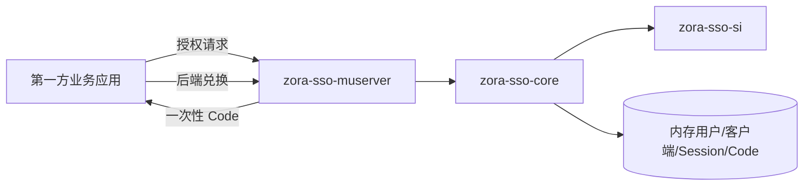

# 本地认证 POC 架构

## 1. 目标

本阶段不部署 Keycloak，由 `zora-sso-muserver` 临时承担登录入口。该实现只服务受控的第一方应用，用于验证中央登录状态、应用回调和身份交接，不声明兼容 OAuth 2.0 或 OpenID Connect。

## 2. 模块边界

- `zora-sso-si` 只包含身份结果和 SSO 服务端口。
- `zora-sso-core` 实现认证、客户端校验、Session、事务、Code 和限流。
- `zora-sso-muserver` 负责 HTTP、HTML、Cookie、配置和错误映射。

依赖方向只能是 `muserver -> core -> si`。

## 3. 信任边界

浏览器参数、Cookie、用户名、密码、Code、客户端密钥和回调地址全部是不可信输入。只有经过以下校验后才能生成 `AuthenticatedIdentity`：

- 客户端已注册且启用。
- 回调 URI 与配置值完整匹配。
- 登录事务和 CSRF Token 有效。
- 用户密码哈希匹配且账号启用。
- Code 未过期、未消费并绑定当前客户端、回调地址和有效 Session。

任一校验失败都终止流程，不创建降级身份。

## 4. Keycloak 迁移边界

正式阶段由 Keycloak 替换本地登录页和 `LocalIdentityAuthenticator`。身份结果、应用 Session、角色映射和审计模型可以保留；临时 `/authorize`、`/login`、`/token/exchange` 协议必须停止对外使用，替换为标准 Authorization Code + PKCE。
