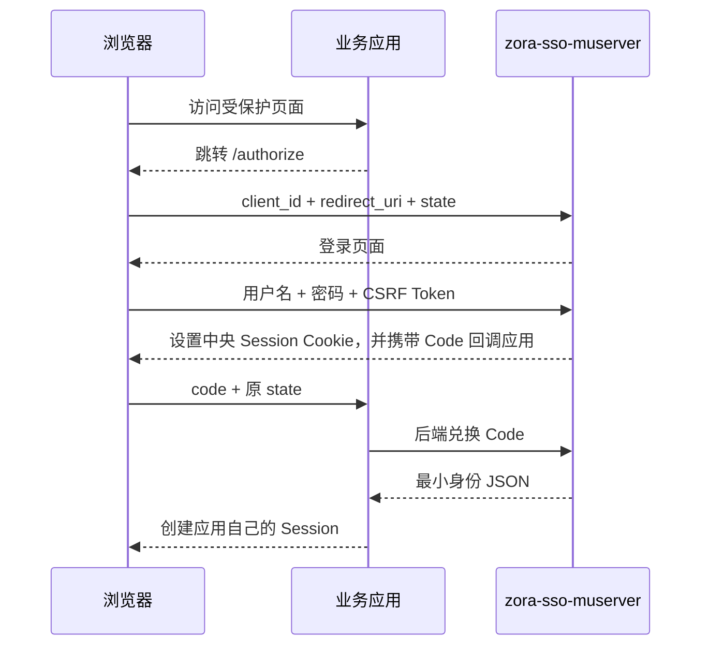

# 本地登录与授权流程

## 1. 时序



用户再次访问其他已注册应用时，浏览器仍访问 `/authorize`，但有效的中央 Session 会跳过密码输入。

## 2. 接口

### `GET /authorize`

参数为 `client_id`、`redirect_uri` 和 `state`。回调地址必须与启动配置完全一致。

### `GET /login`

根据短期授权事务生成 HTML 表单和独立 CSRF Token。

### `POST /login`

只接受 `application/x-www-form-urlencoded`，成功后设置 `HttpOnly`、`SameSite=Lax` 的中央 Session Cookie。

### `POST /token/exchange`

业务应用后端提交：

```text
code=...
client_id=...
client_secret=...
redirect_uri=...
```

成功响应只包含主体、用户名、显示名称、角色和认证时间。Code 默认 30 秒过期且只能使用一次。

### `POST /logout`

删除服务端中央 Session 并清除 Cookie。

## 3. 配置

用户和客户端只允许配置 PBKDF2 哈希：

```hocon
users = [{
  subject = "user-1"
  username = "alice"
  display-name = "Alice"
  password-hash = "pbkdf2-sha256$..."
  roles = ["USER"]
  enabled = true
}]

clients = [{
  client-id = "app-a"
  client-secret-hash = "pbkdf2-sha256$..."
  redirect-uris = ["http://localhost:8081/callback"]
  enabled = true
}]
```

构建后可在交互式终端生成哈希：

```powershell
java -cp .\zora-sso-core\target\classes top.ilovemyhome.zorasso.core.PasswordHashCli
```

## 4. 限制

所有数据在重启后丢失；不支持集群；不提供用户管理、密码找回、MFA、JWT、Refresh Token 或第三方客户端。正式环境必须迁移到标准身份提供方。
