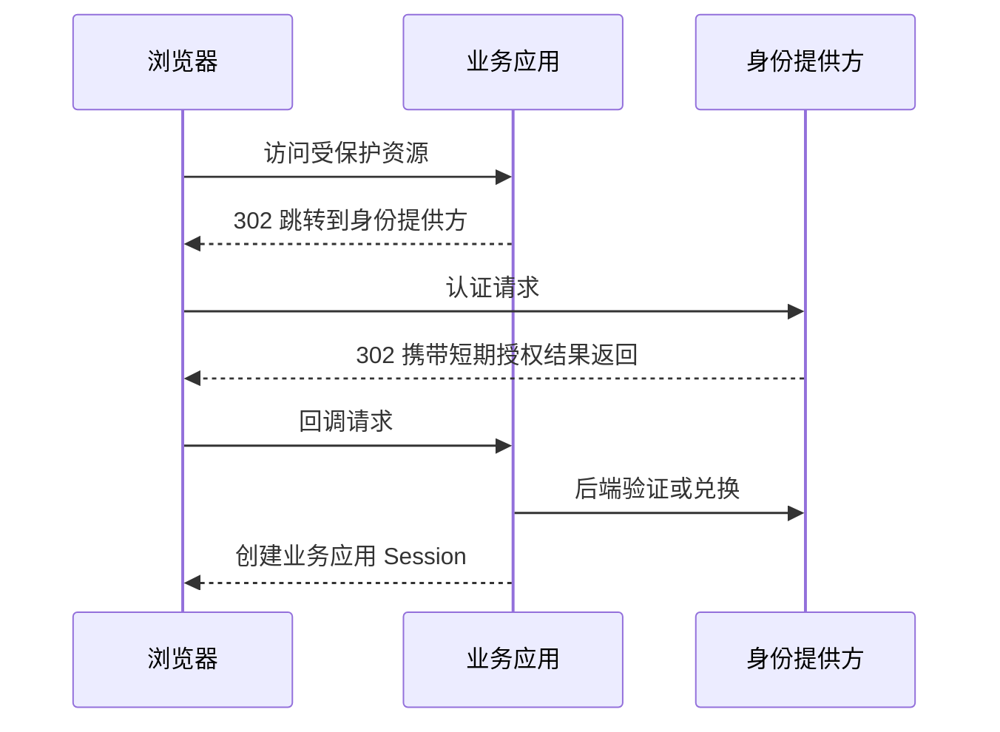

# 认证基础

## 1. 先分清三个问题

| 问题 | 名称 | 典型结果 |
|---|---|---|
| 你是谁？ | 认证 Authentication | 得到稳定用户标识 `subject` |
| 你能做什么？ | 授权 Authorization | 允许或拒绝某项操作 |
| 如何记住你已登录？ | 会话 Session | 浏览器持有不可读的会话标识 |

登录只是认证的一种交互。认证成功不等于拥有所有权限，角色也不应直接等同于具体业务操作。

## 2. Cookie 与服务端 Session

浏览器收到：

```http
Set-Cookie: APP_SESSION=random-value; Path=/; HttpOnly; Secure; SameSite=Lax
```

后续请求自动携带：

```http
Cookie: APP_SESSION=random-value
```

Cookie 只是浏览器的传输容器。服务端通常只保存随机 Session ID 的摘要，并在服务端记录用户、创建时间、空闲过期时间和绝对过期时间。

关键属性：

- `HttpOnly`：阻止 JavaScript 读取 Cookie，降低 XSS 后的凭据窃取风险。
- `Secure`：只通过 HTTPS 发送。
- `SameSite`：限制跨站请求携带 Cookie；不能替代完整 CSRF 防护。
- `Path`、`Domain`：尽量缩小 Cookie 的发送范围。

## 3. 浏览器跳转为什么重要

SSO 同时涉及三个参与方：



浏览器前通道适合跳转，不适合携带长期秘密。敏感兑换和验证应在可信后端进行。

## 4. 信任边界

以下数据都来自边界外，必须视为不可信：

- URL 参数、表单、请求头和 Cookie；
- 回调地址、授权码和 Token；
- 用户名、角色、Claims；
- 代理转发的来源地址。

“数据由登录系统返回”不等于“当前应用可以无条件信任”。应用仍需验证签发者、受众、签名、有效期和请求关联值。

## 5. 检查点

读完本章，应能解释：

1. 为什么认证和授权必须分层。
2. 为什么 Cookie 不等于 Session。
3. 为什么身份回调不能直接相信浏览器提交的用户信息。
4. 为什么 HTTPS、Cookie 属性和服务端过期策略缺一不可。

[下一章：OAuth 2.0 授权](02-OAuth-2.0-授权.md)
