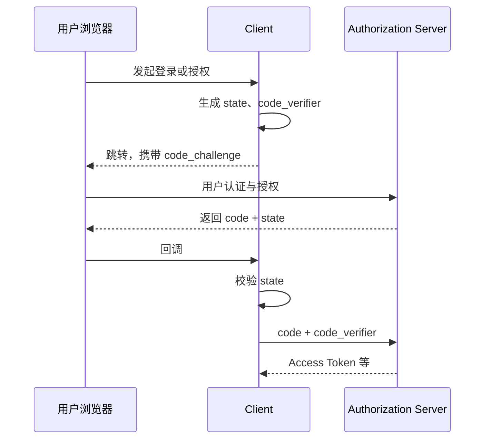
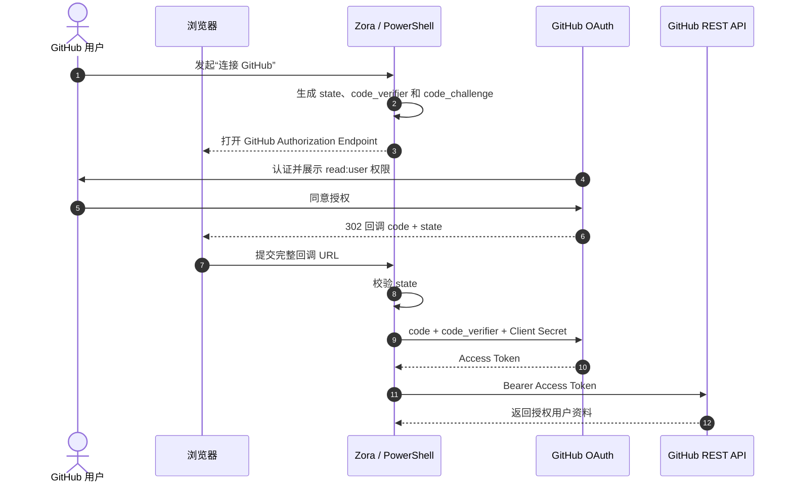

# OAuth 2.0 授权

## 1. OAuth 解决什么问题

OAuth 2.0 让客户端在不获得用户密码的前提下，取得访问资源服务器的受限权限。它回答的是“客户端能否代表资源所有者访问某资源”，不是“当前用户是谁”。

核心角色：

| 角色 | 职责 |
|---|---|
| Resource Owner | 授予访问权限，常见情况下是用户 |
| Client | 请求权限的应用 |
| Authorization Server | 认证用户、获取授权并签发 Token |
| Resource Server | 接收 Access Token 并保护 API（Application Programming Interface，应用程序编程接口） |

OAuth 本身不是登录协议。只有请求 `openid` Scope 并按 OpenID Connect 规则验证 ID Token，才能把流程用于身份认证。仅取得 Access Token，不能证明用户已经登录当前应用。

## 2. Authorization Code + PKCE

现代浏览器、原生应用和服务端 Web 应用的共同主线是授权码模式，并使用 PKCE：



- `code`：短期、一次性，不能直接访问 API。
- `state`：把发起请求与回调关联起来，防止授权 CSRF（Cross-Site Request Forgery，跨站请求伪造）和响应注入。
- `code_verifier`：仅客户端保存。
- `code_challenge`：由 `code_verifier` 派生，授权请求时发送；攻击者只截获 `code` 也无法兑换。

### 2.1 PKCE 到底是什么

PKCE 的全称是 **Proof Key for Code Exchange**，读作“pixy”。它让发起授权的 Client 在兑换 Authorization Code 时证明：“我仍持有这次请求开始前生成的随机秘密。”

| 名称 | 含义 |
|---|---|
| `code_verifier` | Client 用密码学安全随机源生成的高熵字符串，只保存在本地授权事务中 |
| `code_challenge` | 从 `code_verifier` 计算出的公开摘要，随授权请求发送 |
| `S256` | PKCE 转换方式，表示使用 SHA-256 计算摘要 |

使用 `S256` 时，计算关系是：

```text
code_challenge = BASE64URL(SHA256(ASCII(code_verifier)))
```

- **SHA-256**：Secure Hash Algorithm 256-bit，把输入转换成固定长度摘要，不能从摘要直接还原原文。
- **Base64URL**：适合放进 URL 的 Base64 编码变体，使用 `-` 和 `_`，PKCE 中省略末尾的 `=` 填充。

按照 RFC 7636，`code_verifier` 长度为 43～128 个字符，只使用英文字母、数字、`-`、`.`、`_` 和 `~`。不要使用时间戳、递增编号或普通伪随机数生成器。

PKCE 分两段工作：

1. 发起授权时，Client 保存 `code_verifier`，只把 `code_challenge` 和 `S256` 发给 Authorization Server。
2. 兑换 Token 时，Client 提交原始 `code_verifier`；服务器重新计算摘要，并与先前的 `code_challenge` 比较。

即使攻击者截获 Authorization Code，没有 `code_verifier` 也无法兑换 Token。PKCE 不能替代 `state`、精确 Redirect URI 或 Confidential Client 的身份认证，它们防御的是不同风险。

## 3. 客户端类型

- **Confidential Client**：能在后端安全保存凭据，例如传统服务端 Web 应用。
- **Public Client**：无法可靠保存凭据，例如 SPA（Single-Page Application，单页应用）、桌面和移动应用。

不要把发布到浏览器或安装包中的 `client_secret` 当作秘密。Public Client 必须依赖 PKCE、严格回调地址等控制。

## 4. Scope 与最小权限

Scope 表达客户端请求的权限边界，例如 `orders.read`。授权服务器签发的权限不应超过：

1. 客户端被允许申请的范围；
2. 用户或策略允许授予的范围；
3. 当前资源服务器认可的范围。

Scope 不是业务权限模型的全部。资源服务器仍需按租户、资源归属和操作执行授权。

## 5. 工程案例：使用 GitHub OAuth 读取用户资料

这是一个可以亲手完成的 OAuth 2.0 实验：用户在 Zora 开发者门户点击“连接 GitHub”，授权门户读取其 GitHub 资料。门户不会获得用户的 GitHub 密码，也不申请仓库写入权限。

本案例使用 GitHub OAuth App 的 Authorization Code + PKCE Web Flow，只演示委托访问 GitHub API。GitHub OAuth App 不提供 OIDC ID Token，因此不能照搬 OIDC 的 ID Token 校验流程；若产品把它用于“使用 GitHub 登录”，还必须在每次获得 Access Token 后调用 GitHub API 重新确认账号，并把 GitHub 数字用户 ID 作为稳定外部标识。

### 5.1 参与者与端点

| OAuth 角色 | 本案例中的组件 |
|---|---|
| Resource Owner | 执行实验的 GitHub 用户 |
| Client | Zora 开发者门户（本实验用 PowerShell 模拟后端） |
| Authorization Server | GitHub OAuth 服务 |
| Resource Server | GitHub REST API |

```text
authorization_endpoint: https://github.com/login/oauth/authorize
token_endpoint: https://github.com/login/oauth/access_token
resource_endpoint: https://api.github.com/user
redirect_uri: http://127.0.0.1:8080/callback
scope: read:user
client_authentication_method: client_secret_post
```

`read:user` 允许读取用户资料。不要为了“方便以后使用”申请权限很大的 `repo` Scope；它会扩大到用户可访问的私有仓库。

### 5.2 实验准备：注册 GitHub OAuth App

实验需要 GitHub 账号和 PowerShell 5.1 或更高版本。不要使用工作或生产 OAuth App，以免实验配置影响真实用户。

1. 打开 GitHub，依次进入 **Settings > Developer settings > OAuth Apps**。
2. 点击 **New OAuth App** 或 **Register a new application**。
3. 填写：

   | 字段 | 实验值 |
   |---|---|
   | Application name | `Zora OAuth Lab`，如名称冲突可自行修改 |
   | Homepage URL | `http://127.0.0.1:8080` |
   | Authorization callback URL | `http://127.0.0.1:8080/callback` |

4. 点击 **Register application**，记录页面显示的 Client ID。
5. 点击 **Generate a new client secret**，临时记录 Secret。Secret 只显示一次，不要写入 Git、聊天记录、截图或命令历史。

生产环境的回调地址应使用 HTTPS。这里使用环回地址是为了本机实验；本实验不启动 Web 服务，浏览器回调时出现“无法访问此网站”是预期现象。

### 5.3 完整交互



### 5.4 实验步骤一：生成授权请求

打开一个新的 PowerShell 窗口，设置刚才得到的 Client ID 和 Client Secret。后续命令必须在同一个窗口执行：

```powershell
$env:GITHUB_CLIENT_ID = "<your-client-id>"
$env:GITHUB_CLIENT_SECRET = "<your-client-secret>"
$redirectUri = "http://127.0.0.1:8080/callback"
```

定义 Base64URL 函数，并使用密码学安全随机源生成 `state` 和符合 RFC 7636 长度要求的 `code_verifier`：

```powershell
function New-Base64Url([int]$byteLength) {
    $bytes = New-Object byte[] $byteLength
    $rng = [System.Security.Cryptography.RandomNumberGenerator]::Create()
    try {
        $rng.GetBytes($bytes)
    } finally {
        $rng.Dispose()
    }

    [Convert]::ToBase64String($bytes).TrimEnd("=").Replace("+", "-").Replace("/", "_")
}

$state = New-Base64Url 32
$codeVerifier = New-Base64Url 64
$verifierBytes = [Text.Encoding]::ASCII.GetBytes($codeVerifier)
$sha256 = [Security.Cryptography.SHA256]::Create()
try {
    $challengeBytes = $sha256.ComputeHash($verifierBytes)
} finally {
    $sha256.Dispose()
}
$codeChallenge = [Convert]::ToBase64String($challengeBytes).TrimEnd("=").Replace("+", "-").Replace("/", "_")
```

构造授权 URL 并在默认浏览器打开：

```powershell
$authorizeUrl = "https://github.com/login/oauth/authorize" +
    "?client_id=$([Uri]::EscapeDataString($env:GITHUB_CLIENT_ID))" +
    "&redirect_uri=$([Uri]::EscapeDataString($redirectUri))" +
    "&scope=$([Uri]::EscapeDataString('read:user'))" +
    "&state=$([Uri]::EscapeDataString($state))" +
    "&code_challenge=$([Uri]::EscapeDataString($codeChallenge))" +
    "&code_challenge_method=S256"

Start-Process $authorizeUrl
```

GitHub 页面应显示应用名称及它申请的权限。确认是刚创建的实验应用后点击 **Authorize**；如果页面展示了超出 `read:user` 的权限，应停止实验并检查 URL 和 OAuth App 配置。

### 5.5 实验步骤二：取得 Code 并校验 State

授权后，GitHub 会跳转到类似下面的地址：

```text
http://127.0.0.1:8080/callback?code=临时授权码&state=随机值
```

因为本实验没有启动本地服务器，页面会连接失败。此时从浏览器地址栏复制**完整 URL**，粘贴给下面的 `$callbackUrl`：

```powershell
$callbackUrl = Read-Host "Paste the complete callback URL"
$callbackUri = [Uri]$callbackUrl
$callbackParams = @{}

$callbackUri.Query.TrimStart("?").Split("&") | ForEach-Object {
    $pair = $_ -split "=", 2
    if ($pair.Count -eq 2) {
        $callbackParams[$pair[0]] = [Uri]::UnescapeDataString($pair[1])
    }
}

if ($callbackParams["error"]) {
    throw "GitHub authorization failed: $($callbackParams['error'])"
}
if (-not $callbackParams["state"] -or $callbackParams["state"] -cne $state) {
    throw "OAuth state is missing or does not match; stop the flow."
}
if (-not $callbackParams["code"]) {
    throw "Authorization code is missing; stop the flow."
}

$code = $callbackParams["code"]
```

GitHub 的授权码约 10 分钟后过期，并且只能兑换一次。真实服务还必须给授权事务设置短过期时间，并在校验成功后原子地将 `state` 标记为已消费；缺失、不匹配、过期或重复的回调都必须默认拒绝。

### 5.6 实验步骤三：兑换 Access Token

由“后端”直接调用 Token Endpoint。`Client Secret` 和 `code_verifier` 都不应经浏览器传递：

```powershell
$tokenResponse = Invoke-RestMethod `
    -Method Post `
    -Uri "https://github.com/login/oauth/access_token" `
    -Headers @{ Accept = "application/json" } `
    -ContentType "application/x-www-form-urlencoded" `
    -Body @{
        client_id     = $env:GITHUB_CLIENT_ID
        client_secret = $env:GITHUB_CLIENT_SECRET
        code          = $code
        redirect_uri  = $redirectUri
        code_verifier = $codeVerifier
    }

if ($tokenResponse.error) {
    throw "Token exchange failed: $($tokenResponse.error)"
}
if (-not $tokenResponse.access_token) {
    throw "GitHub did not return an access token."
}

$accessToken = $tokenResponse.access_token
$tokenResponse | Select-Object token_type, scope, expires_in
```

不要输出 `$accessToken`。GitHub OAuth App 可以启用短期 Access Token；启用后响应还会包含 `expires_in`、`refresh_token` 和 `refresh_token_expires_in`。Access Token 和 Refresh Token 都是敏感凭据，生产系统应加密存储，并实现轮换和撤销。

### 5.7 实验步骤四：调用 GitHub REST API

将 Access Token 放入 Authorization Header，调用 `GET /user`：

```powershell
$headers = @{
    Accept                 = "application/vnd.github+json"
<# Equivalent wire-level headers:
Authorization: Bearer <access-token>
Accept: application/json
#>
    "X-GitHub-Api-Version" = "2026-03-10"
    "User-Agent"           = "zora-oauth-lab"
}
$scheme = "Bear" + "er"
$headers["Authorization"] = "$scheme $accessToken"

$user = Invoke-RestMethod `
    -Method Get `
    -Uri "https://api.github.com/user" `
    -Headers $headers

$user | Select-Object login, id, name, html_url
```

预期结果类似：

```text
login      id        name        html_url
-----      --        ----        --------
octocat    583231    The Octocat https://github.com/octocat
```

其中 `id` 是 GitHub 账号的稳定数字标识；`login`、名称和邮箱都可能变化，不能代替 `id` 作为外部账号主键。客户端应把 Access Token 当作不透明凭据，不解析其格式，也不能把它发送给 GitHub 之外的 API。

### 5.8 实验步骤五：失败验证与清理

可以重新执行 Token 请求，观察同一个 Code 被拒绝；也可以修改 `$codeVerifier` 后重新走一遍授权流程，观察 PKCE 校验失败。测试失败分支时不要关闭当前 PowerShell 窗口，否则原始 `state` 和 `code_verifier` 会丢失。

实验结束后：

1. 在 GitHub 打开 **Settings > Applications > Authorized OAuth Apps**，找到实验应用并点击 **Revoke**。
2. 在 **Settings > Developer settings > OAuth Apps** 中删除实验 Secret；不再使用该应用时删除整个 OAuth App。
3. 清除当前 PowerShell 进程中的敏感变量：

```powershell
$env:GITHUB_CLIENT_SECRET = $null
Remove-Variable accessToken, tokenResponse, code, codeVerifier -ErrorAction SilentlyContinue
```

仅清除变量不能撤销已签发 Token，因此 GitHub 页面中的 **Revoke** 是必需步骤。

### 5.9 每个安全参数究竟保护什么

| 参数或检查 | 防御目标 | 缺失时的典型风险 |
|---|---|---|
| `state` | 绑定浏览器发起的授权事务与回调 | 授权 CSRF、回调串线 |
| PKCE | 证明兑换方持有原始 `code_verifier` | 授权码被截获后兑换 |
| 精确 Redirect URI | 把 Code 送回预期回调 | Code 被发送到错误地址 |
| Client Secret | 证明兑换方是该 Confidential Client | 客户端被冒充 |
| `read:user` | 只申请读取用户资料 | 取得仓库或写操作等过大权限 |
| 每次获取 Token 后调用 `/user` | 确认 Token 当前代表的 GitHub 账号 | 把浏览器中切换后的账号关联给错误用户 |
| Token 仅发送给 GitHub API | 限制凭据的使用位置 | Token 泄漏给第三方服务 |

这条链路说明了 OAuth 的边界：GitHub 授予 Zora“代表用户读取 GitHub 资料”的有限能力。它没有向 Zora 签发 OIDC ID Token，也没有替代 Zora 自己的会话、租户权限或业务授权。

GitHub 官方目前更推荐新项目评估 GitHub App，因为它支持更细粒度的权限、仓库范围选择和短期 Token。OAuth App 仍适合本章用来理解标准授权码流程。

## 6. 不再推荐的模式

- **Implicit Grant**：Token 经浏览器前通道返回，现代实践应改用 Authorization Code + PKCE。
- **Resource Owner Password Credentials**：客户端直接收集用户密码，破坏身份提供方边界，不应使用。
- **仅靠 Client Credentials 表示用户**：该模式表示客户端自身，不代表终端用户。

## 7. 最常见的误区

- 用 Access Token 证明“用户已登录”；
- 回调地址使用通配符或前缀匹配；
- 认为有 PKCE 就可以省略 `state`；
- 在 URL、日志或浏览器存储中长期保存 Token；
- API 只解析 JWT（JSON Web Token），不验证签名和 Claims。

## 8. 术语与缩写附录

正文在术语首次出现时给出解释，本表用于集中查阅。

### 8.1 常见缩写

| 术语 | 英文全称 | 含义 |
|---|---|---|
| OAuth 2.0 | OAuth 2.0 Authorization Framework | 委托授权框架；OAuth 是协议名称，不必按字母拆解 |
| PKCE | Proof Key for Code Exchange | 授权码交换证明，防止截获的授权码被他人兑换 |
| API | Application Programming Interface | 应用程序编程接口，例如 GitHub REST API |
| CSRF | Cross-Site Request Forgery | 跨站请求伪造；攻击者诱导浏览器完成非用户本意的请求 |
| SPA | Single-Page Application | 单页应用，代码主要运行在浏览器中，不能安全保存 Client Secret |
| OIDC | OpenID Connect | 建立在 OAuth 2.0 之上的身份认证协议，回答“用户是谁” |
| JWT | JSON Web Token | 一种可签名的 Token 表达格式；Access Token 不一定是 JWT |
| HTTP / HTTPS | Hypertext Transfer Protocol / HTTP Secure | 浏览器和服务端使用的通信协议；生产 OAuth 回调应使用 HTTPS |
| URI / URL | Uniform Resource Identifier / Uniform Resource Locator | URI 是资源标识；URL 是包含访问位置的 URI，Redirect URI 通常表现为 URL |

### 8.2 流程术语

| 术语 | 解释 |
|---|---|
| Authorization Code | 授权码；短期、一次性的中间凭据，只能用于兑换 Token |
| Access Token | 访问令牌；Client 调用 Resource Server API 时提交的凭据 |
| Bearer Token | 持有者令牌；任何拿到它的人都可能使用，因此必须防止泄漏 |
| Scope | 权限范围；描述 Client 申请的操作类别，例如 GitHub 的 `read:user` |
| Client ID | Client 的公开标识，用于说明“哪个应用正在申请授权” |
| Client Secret | Confidential Client 的机密凭据，只能保存在可信后端 |
| Redirect URI | 授权完成后的回调地址，必须与预注册值精确匹配 |
| Authorization Endpoint | 浏览器前往的授权端点，负责用户交互并返回 Authorization Code |
| Token Endpoint | Client 后端兑换 Token 的端点，不应由浏览器直接携带 Secret 调用 |
| `state` | Client 生成的随机关联值，用于绑定发起请求与回调，防御授权 CSRF 和响应注入 |
| Claim | Token 中关于签发者、接收方、有效期或主体的一项声明 |

## 9. 检查点

能展开 PKCE 的英文全称，说明 `code_verifier`、`code_challenge` 和 `S256` 的关系，并准确解释 `state`、PKCE、Scope、Redirect URI 和资源级授权各自解决的问题。

[下一章：OpenID Connect 身份认证](03-OpenID-Connect-身份认证.md)
