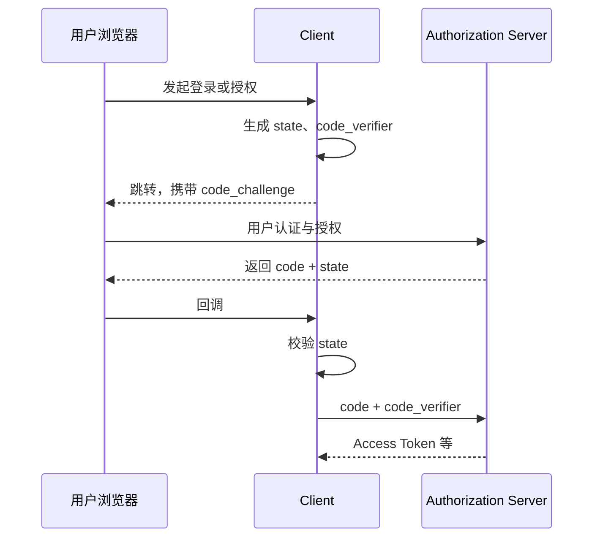
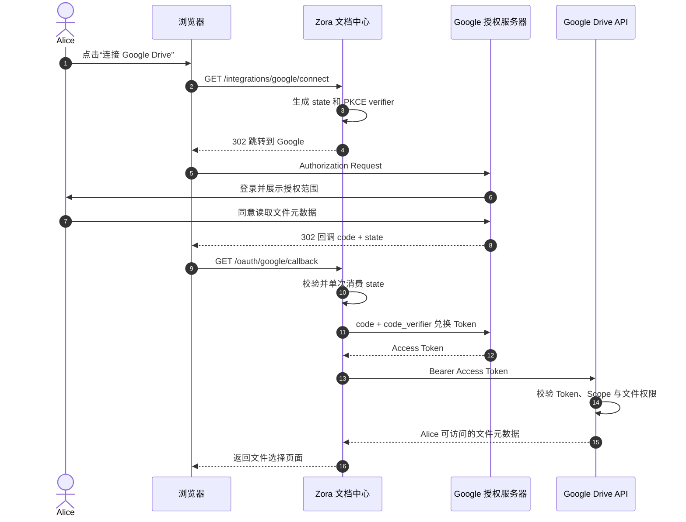

# OAuth 2.0 授权

## 1. OAuth 解决什么问题

OAuth 2.0 让客户端在不获得用户密码的前提下，取得访问资源服务器的受限权限。它回答的是“客户端能否代表资源所有者访问某资源”，不是“当前用户是谁”。

核心角色：

| 角色 | 职责 |
|---|---|
| Resource Owner | 授予访问权限，常见情况下是用户 |
| Client | 请求权限的应用 |
| Authorization Server | 认证用户、获取授权并签发 Token |
| Resource Server | 接收 Access Token 并保护 API |

## 2. Authorization Code + PKCE

现代浏览器、原生应用和服务端 Web 应用的共同主线是授权码模式，并使用 PKCE：



- `code`：短期、一次性，不能直接访问 API。
- `state`：把发起请求与回调关联起来，防止登录 CSRF 和响应注入。
- `code_verifier`：仅客户端保存。
- `code_challenge`：由 `code_verifier` 派生，授权请求时发送；攻击者只截获 `code` 也无法兑换。

## 3. 客户端类型

- **Confidential Client**：能在后端安全保存凭据，例如传统服务端 Web 应用。
- **Public Client**：无法可靠保存凭据，例如 SPA、桌面和移动应用。

不要把发布到浏览器或安装包中的 `client_secret` 当作秘密。Public Client 必须依赖 PKCE、严格回调地址等控制。

## 4. Scope 与最小权限

Scope 表达客户端请求的权限边界，例如 `orders.read`。授权服务器签发的权限不应超过：

1. 客户端被允许申请的范围；
2. 用户或策略允许授予的范围；
3. 当前资源服务器认可的范围。

Scope 不是业务权限模型的全部。资源服务器仍需按租户、资源归属和操作执行授权。

## 5. 工程案例：从 Google Drive 读取文件列表

这是一个常见的真实工程需求：Alice 在 Zora 文档中心选择“连接 Google Drive”，授权应用读取她的文件元数据。应用不获取 Alice 的 Google 密码，也不能修改或删除她的文件。

本案例只讨论 OAuth 2.0 委托授权，不把 Google 账号当作 Zora 登录方式。Zora 文档中心仍使用自己的登录会话；Google Access Token 只用于访问 Google Drive API。

### 5.1 参与者和工程配置

| OAuth 角色 | 本案例中的组件 |
|---|---|
| Resource Owner | Alice |
| Client | Zora 文档中心服务端 Web 应用 |
| Authorization Server | Google OAuth 2.0 Authorization Server |
| Resource Server | Google Drive API |

文档中心是 Confidential Client，需要先在 Google Cloud Console 创建 OAuth Client，并精确注册回调地址。以下 Client ID 仅为示例：

```text
authorization_endpoint: https://accounts.google.com/o/oauth2/v2/auth
token_endpoint: https://oauth2.googleapis.com/token
client_id: 123456789-example.apps.googleusercontent.com
client_authentication_method: client_secret_post
client_secret: 从 Secret Manager 注入，不写入仓库
redirect_uri: https://docs.zora.example/oauth/google/callback
scope: https://www.googleapis.com/auth/drive.metadata.readonly
```

`drive.metadata.readonly` 允许读取文件名、类型等元数据，但不能读取文件内容。若产品只需要展示文件列表，就不应申请权限更大的 `drive.readonly` 或完整 Drive Scope。

### 5.2 完整交互



#### 第一步：客户端发起授权请求

Alice 点击连接按钮后，文档中心生成高熵随机的 `state` 和 `code_verifier`，保存到短期、一次性的服务端授权事务中，再计算：

```text
code_challenge = BASE64URL(SHA256(code_verifier))
```

浏览器收到 302，并跳转到 Google。为便于阅读，下面将 URL 分行展示；实际请求是一个完整 URL：

```http
GET /o/oauth2/v2/auth
    ?response_type=code
    &client_id=123456789-example.apps.googleusercontent.com
    &redirect_uri=https%3A%2F%2Fdocs.zora.example%2Foauth%2Fgoogle%2Fcallback
    &scope=https%3A%2F%2Fwww.googleapis.com%2Fauth%2Fdrive.metadata.readonly
    &state=mV9Z2Qp7xK4n8R3cT6w1
    &code_challenge=E9Melhoa2OwvFrEMTJguCHaoeK1t8URWbuGJSstw-cM
    &code_challenge_method=S256 HTTP/1.1
Host: accounts.google.com
```

请求中没有 `openid` Scope，因为这里不是用 Google 完成登录，而是申请访问 Drive API 的权限。这也说明 OAuth Access Token 不等于用户登录凭证。

#### 第二步：用户同意后返回授权码

Google 向 Alice 展示应用名称和申请的权限。Alice 同意后，Google 不会把 Access Token 放进浏览器 URL，而是携带短期、一次性的授权码返回精确注册的回调地址：

```http
HTTP/1.1 302 Found
Location: https://docs.zora.example/oauth/google/callback?code=4%2F0AbUR2VExample&state=mV9Z2Qp7xK4n8R3cT6w1
```

文档中心必须先恒定时间比较 `state`，再原子地消费授权事务。缺失、不匹配、过期或已经使用过的 `state` 都应终止流程，不能继续兑换 Token。

如果 Alice 拒绝授权，Google 会回调 `error=access_denied&state=...`。文档中心仍须校验并消费 `state`，但不能调用 Token Endpoint，也不应把拒绝展示成系统故障。

#### 第三步：后端兑换 Access Token

文档中心后端直接调用 Google Token Endpoint。浏览器不参与这个请求，也不接触 Client Secret 或 `code_verifier`：

```http
POST /token HTTP/1.1
Host: oauth2.googleapis.com
Content-Type: application/x-www-form-urlencoded

grant_type=authorization_code&
code=4%2F0AbUR2VExample&
client_id=123456789-example.apps.googleusercontent.com&
client_secret=<client-secret>&
redirect_uri=https%3A%2F%2Fdocs.zora.example%2Foauth%2Fgoogle%2Fcallback&
code_verifier=dBjftJeZ4CVP-mB92K27uhbUJU1p1r_wW1gFWFOEjXk
```

Google 会校验 Code、客户端身份、原始 Redirect URI 和 PKCE。任意一项不匹配都会拒绝兑换。示例中的凭据和 Token 均为占位值，真实值不得写入文档、URL 或日志。

简化后的成功响应如下：

```json
{
  "access_token": "<access-token>",
  "token_type": "Bearer",
  "expires_in": 3599,
  "scope": "https://www.googleapis.com/auth/drive.metadata.readonly"
}
```

授权服务器签发的实际 Scope 可能少于请求值，客户端必须以响应和 Token 中的最终授权范围为准，不能假定请求过的权限一定获批。

#### 第四步：使用 Access Token 调用 Drive API

文档中心把 Access Token 放在 Authorization Header 中，而不是查询参数中。它应把 Access Token 当作不透明凭据，不依赖其内部格式：

```http
GET /drive/v3/files?pageSize=10&fields=files(id,name,mimeType) HTTP/1.1
Host: www.googleapis.com
Authorization: Bearer <access-token>
Accept: application/json
```

Google Drive API 验证 Token、Scope 和 Alice 对每个文件的访问权限。文档中心不自行解析 Token，也不能把它发送给其他 API。Token 过期或无效时，API 会拒绝请求；Scope 不足时，应用应提示用户重新授权所需范围。

成功响应只包含 Alice 当前有权访问、且该 Scope 允许读取的文件元数据。即使 Token 有效，Google Drive 的共享关系和文件权限仍可能阻止访问某个文件。

### 5.3 每个安全参数究竟保护什么

| 参数或检查 | 防御目标 | 缺失时的典型风险 |
|---|---|---|
| `state` | 绑定浏览器发起的授权事务与回调 | 授权 CSRF、回调串线 |
| PKCE | 证明兑换方持有原始 `code_verifier` | 授权码被截获后兑换 |
| 精确 Redirect URI | 把 Code 只交给已注册回调 | Code 被送到攻击者控制的地址 |
| Client Authentication | 证明兑换方是 Confidential Client | 客户端被冒充 |
| `drive.metadata.readonly` | 只允许读取 Drive 文件元数据 | 应用获得读取内容或修改文件的过大权限 |
| Drive 文件权限 | 限制 Alice 实际可以访问的文件 | 仅凭 Scope 绕过资源所有权和共享规则 |
| Token 仅发送给 Drive API | 限制凭据的使用位置 | Token 泄漏或被错误发送给其他服务 |

这条链路说明了 OAuth 的边界：Google 授予 Zora 文档中心“代表 Alice 读取 Drive 文件元数据”的有限能力，Drive API 仍保留对具体文件的最终授权决定权。

如果改为访问 Zora 自己的 API，资源服务器还需要执行 [Token 与校验](05-Token与校验.md) 中的完整验证，并在 Scope 之外继续检查租户和资源归属。

## 6. 不再推荐的模式

- **Implicit Grant**：Token 经浏览器前通道返回，现代实践应改用 Authorization Code + PKCE。
- **Resource Owner Password Credentials**：客户端直接收集用户密码，破坏身份提供方边界，不应使用。
- **仅靠 Client Credentials 表示用户**：该模式表示客户端自身，不代表终端用户。

## 7. 最常见的误区

- 用 Access Token 证明“用户已登录”；
- 回调地址使用通配符或前缀匹配；
- 认为有 PKCE 就可以省略 `state`；
- 在 URL、日志或浏览器存储中长期保存 Token；
- API 只解析 JWT，不验证签名和 Claims。

## 8. 检查点

能画出授权码模式，说明浏览器前通道与后端通道的区别，并准确解释 `state`、PKCE、Audience、Scope 和资源级授权各自解决的问题。

[下一章：OpenID Connect 身份认证](03-OpenID-Connect-身份认证.md)
