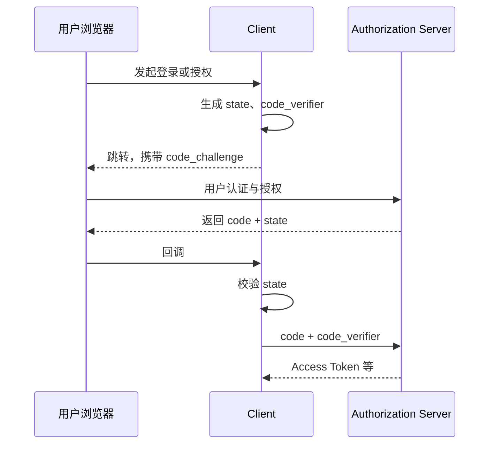

# OAuth 2.0 授权

## 1. OAuth 解决什么问题

OAuth 2.0 让客户端在不获得用户密码的前提下，取得访问资源服务器的受限权限。它回答的是“客户端能否代表资源所有者访问某资源”，不是“当前用户是谁”。

核心角色：

| 角色 | 职责 |
|---|---|
| Resource Owner | 授予访问权限，常见情况下是用户 |
| Client | 请求权限的应用 |
| Authorization Server | 认证用户、获取授权并签发 Token |
| Resource Server | 接收 Access Token 并保护 API |

## 2. Authorization Code + PKCE

现代浏览器、原生应用和服务端 Web 应用的共同主线是授权码模式，并使用 PKCE：

- `code`：短期、一次性，不能直接访问 API。
- `state`：把发起请求与回调关联起来，防止登录 CSRF 和响应注入。
- `code_verifier`：仅客户端保存。
- `code_challenge`：由 `code_verifier` 派生，授权请求时发送；攻击者只截获 `code` 也无法兑换。

## 3. 客户端类型

- **Confidential Client**：能在后端安全保存凭据，例如传统服务端 Web 应用。
- **Public Client**：无法可靠保存凭据，例如 SPA、桌面和移动应用。

不要把发布到浏览器或安装包中的 `client_secret` 当作秘密。Public Client 必须依赖 PKCE、严格回调地址等控制。

## 4. Scope 与最小权限

Scope 表达客户端请求的权限边界，例如 `orders.read`。授权服务器签发的权限不应超过：

1. 客户端被允许申请的范围；
2. 用户或策略允许授予的范围；
3. 当前资源服务器认可的范围。

Scope 不是业务权限模型的全部。资源服务器仍需按租户、资源归属和操作执行授权。

## 5. 不再推荐的模式

- **Implicit Grant**：Token 经浏览器前通道返回，现代实践应改用 Authorization Code + PKCE。
- **Resource Owner Password Credentials**：客户端直接收集用户密码，破坏身份提供方边界，不应使用。
- **仅靠 Client Credentials 表示用户**：该模式表示客户端自身，不代表终端用户。

## 6. 最常见的误区

- 用 Access Token 证明“用户已登录”；
- 回调地址使用通配符或前缀匹配；
- 认为有 PKCE 就可以省略 `state`；
- 在 URL、日志或浏览器存储中长期保存 Token；
- API 只解析 JWT，不验证签名和 Claims。

## 7. 检查点

能画出授权码模式，并准确说明 `state` 与 PKCE 防御的是不同问题。

[下一章：OpenID Connect 身份认证](03-OpenID-Connect-身份认证.md)
