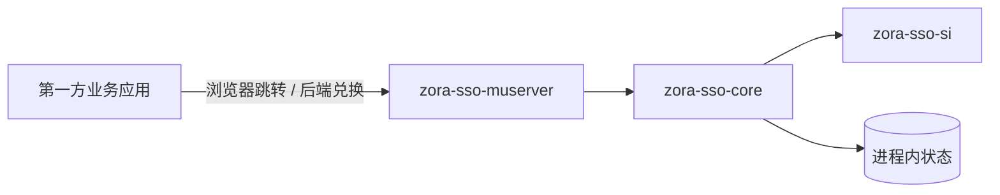

# 本地认证 POC 架构

**状态：已实现，但禁止生产使用。**

## 1. 目标与非目标

当前实现用于验证：

- 一个中央登录入口能否服务多个已注册的第一方应用；
- 中央 Session 能否让后续应用跳过密码输入；
- 应用能否通过短期一次性 Code 在后端取得最小身份信息。

它不实现 OAuth 2.0、OpenID Connect、JWT、Refresh Token、MFA、用户管理或标准单点登出，不允许第三方客户端接入。

## 2. 模块与依赖

依赖方向固定为 `zora-sso-muserver -> zora-sso-core -> zora-sso-si`。

| 模块 | 当前职责 | 关键入口 |
|---|---|---|
| `zora-sso-si` | 身份结果与 SSO 服务端口 | `SsoService`、`AuthenticatedIdentity` |
| `zora-sso-core` | 用户认证、客户端校验、事务、Session、Code、限流 | `InMemoryLocalSsoService` |
| `zora-sso-muserver` | HTTP、HTML、Cookie、配置和错误映射 | `SsoWebServer`、`SsoConfiguration` |

## 3. 状态模型

所有状态都在单进程内存中：

| 状态 | 默认期限 | 关键绑定 |
|---|---|---|
| 登录事务 | 5 分钟 | Client、回调 URI、`state`、CSRF 摘要 |
| 中央 Session | 空闲 2 小时，绝对 8 小时 | 已认证身份 |
| 一次性 Code | 30 秒 | Client、回调 URI、Session、身份 |
| 登录失败记录 | 5 分钟窗口 | 规范化用户名 + 来源地址 |

Session ID、事务 ID、CSRF Token 和 Code 使用 256 bit 随机值。服务端 Map 保存其 SHA-256 摘要，不保存原始值。

## 4. 核心不变量

- Client 必须存在、启用，回调 URI 必须完整匹配预注册值。
- `state` 必填、非空且不超过 512 字符。
- 登录必须有未过期事务和匹配的 CSRF Token。
- 登录成功后事务原子消费，并创建全新的中央 Session。
- Code 必须在有效期内由绑定的 Client 和回调 URI 单次兑换。
- Code 绑定的中央 Session 必须仍然有效。
- 用户密码和 Client Secret 只接受 PBKDF2 哈希配置。
- 任何校验失败都不得创建身份或回退到较弱认证。

## 5. 为什么不能生产使用

进程重启会丢失全部状态，多节点之间无法共享或撤销会话；协议为项目私有协议，没有标准互操作和生态安全审计；用户生命周期、MFA、账号恢复、集中审计及密钥托管均缺失。

生产替代方案见 [生产级 OIDC 目标架构](04-ARCHITECTURE-生产级OIDC目标架构.md)。
