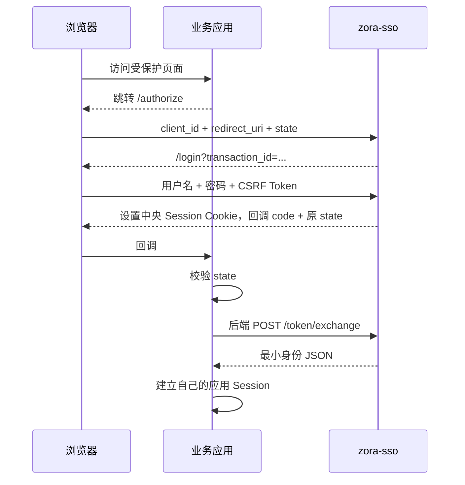

# 本地登录与授权流程

**状态：已实现，但禁止生产使用。**

## 1. 启动前配置

默认配置没有用户或客户端。先构建：

```powershell
mvn clean verify
```

再运行 `top.ilovemyhome.zorasso.core.PasswordHashCli`，分别生成用户密码和 Client Secret 的 PBKDF2 哈希。将哈希写入 `zora-sso-muserver\src\main\resources\application.conf`：

```hocon
zora-sso {
  environment = "development"
  local-auth {
    enabled = true
    production-allowed = false
  }
  server {
    host = "127.0.0.1"
    port = 9080
    public-base-url = "http://localhost:9080"
  }
  cookie {
    name = "ZORA_SSO_SESSION"
    secure = false
  }
  users = [{
    subject = "user-1"
    username = "alice"
    display-name = "Alice"
    password-hash = "pbkdf2-sha256$..."
    roles = ["USER"]
    enabled = true
  }]
  clients = [{
    client-id = "app-a"
    client-secret-hash = "pbkdf2-sha256$..."
    redirect-uris = ["http://localhost:8081/callback"]
    enabled = true
  }]
}
```

从 IDE 运行 `top.ilovemyhome.zorasso.muserver.App`。非本机 URL 必须使用 HTTPS；生产环境默认拒绝本地认证模式，不能把 `production-allowed` 当作上线开关。

## 2. 完整流程



再次访问另一个已注册应用时，`/authorize` 检测到有效中央 Session，会直接签发新的 Code，不再显示登录页。

## 3. 接口契约

| 接口 | 输入 | 成功结果 |
|---|---|---|
| `GET /authorize` | `client_id`、`redirect_uri`、`state` | 跳转登录页或已注册回调 |
| `GET /login` | `transaction_id` | 带独立 CSRF Token 的 HTML 表单 |
| `POST /login` | URL-encoded 事务、CSRF、用户名、密码 | 设置中央 Cookie 并回调 |
| `POST /token/exchange` | Code、Client、Secret、回调 URI | `AuthenticatedIdentity` JSON |
| `POST /logout` | 中央 Session Cookie | 删除中央 Session 并清 Cookie |
| `GET /health` | 无 | 本地模式健康状态 |

`POST` 只接受 `application/x-www-form-urlencoded`。表单参数不允许重复，请求体和服务器请求大小均受限。

## 4. 客户端必须完成的工作

1. 每次授权生成不可预测的 `state`，保存在服务端授权事务中。
2. 回调时恒定时间比较并单次消费 `state`。
3. 只允许后端持有和提交 Client Secret。
4. 兑换成功后，以 `subject` 为外部身份键建立应用 Session。
5. 对角色执行允许列表映射，不直接信任任意字符串。
6. 不记录 Code、Client Secret、中央 Cookie 或返回的敏感身份数据。

当前 POC 未提供客户端 SDK，上述约束由接入应用负责。
