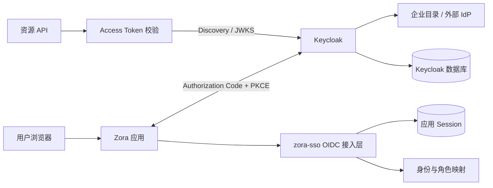

# 生产级 OIDC 目标架构

**状态：目标设计，尚未实现。**

## 1. 架构决策

生产环境由 Keycloak 承担 OpenID Provider；`zora-sso` 不实现协议端点和 Token 签发，而是为 Zora 应用提供统一的 OIDC Client、Token 校验、身份映射和应用会话能力。

## 2. 责任边界

| Keycloak | zora-sso | 业务应用 |
|---|---|---|
| 用户认证、MFA、恢复 | 协议客户端封装 | 发起登录与业务授权 |
| 标准端点和 Token | 严格 Token 校验 | 管理本地 Session |
| 中央会话与联合身份 | `(iss, sub)` 身份映射 | 按资源执行权限判断 |
| 签名密钥与 JWKS | 外部角色允许列表映射 | 处理本地登出体验 |
| Realm 与 Client 策略 | 审计事件统一模型 | 不接触用户密码 |

## 3. 模块演进

建议保留依赖方向，但替换实现：

- `zora-sso-si`：扩展为与 Provider 无关的登录事务、身份结果和 Token 验证端口。
- `zora-sso-core`：新增 OIDC Discovery、授权请求、回调校验、JWKS 缓存、身份映射与会话策略。
- `zora-sso-muserver`：只提供应用需要的 HTTP 适配器；不再托管用户名密码登录页。
- 当前 `LocalIdentityAuthenticator` 和私有 `/token/exchange` 只在开发 POC profile 中存在，迁移完成后删除。

## 4. 核心安全不变量

- Provider Issuer 必须由部署配置允许，不能由请求动态决定。
- Authorization Code + PKCE 强制使用 `S256`。
- `state`、`nonce` 和 PKCE verifier 绑定同一服务端事务并单次消费。
- 回调后完整验证 ID Token；API 完整验证 Access Token。
- 外部身份键使用 `(iss, sub)`，冲突时拒绝自动合并。
- 外部角色通过允许列表映射，未知角色不授予权限。
- Provider 或密钥无法在安全窗口内验证时失败关闭。
- 浏览器默认只持有应用 Session Cookie，不暴露长期 Token。

## 5. 部署拓扑

生产至少区分：

- 两个以上 Keycloak 节点和受支持的外部数据库；
- TLS 终止与可信代理边界；
- Secret 管理系统；
- 高可用应用 Session 存储；
- 集中日志、指标、告警和审计存储；
- 独立的开发、测试、预生产和生产 Realm 或实例。

Realm 不是任意多租户隔离的默认答案。租户模型、管理边界和数据隔离必须单独设计。

## 6. 非目标

- 不自行实现 OIDC Provider；
- 不在 `zora-sso` 保存终端用户密码；
- 不让所有应用共享一个跨域 Cookie；
- 不以 Keycloak 角色替代业务资源级授权；
- 不在 Provider 故障时创建降级管理员或绕过验证。
